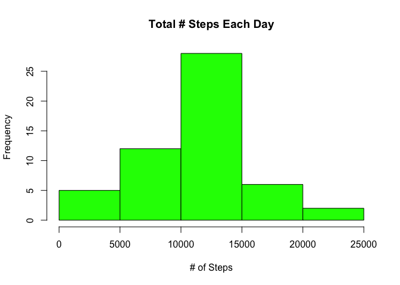

# Reproducible Research: Peer Assessment 1

## Loading and preprocessing the data

```r
library(lattice)
library(plyr)
```

```
## Warning: package 'plyr' was built under R version 3.1.3
```

```r
fitbit <- read.csv("activity.csv")
```
## What is mean total number of steps taken per day?

```r
totSteps <- ddply(fitbit, "date", summarize, numSteps = sum(steps))
hist(totSteps$numSteps, main = "Total # Steps Each Day", col = "blue", 
     xlab = "# of Steps")
```

 

```r
step_mean <- mean(totSteps$numSteps, na.rm = TRUE)
step_median <- median(totSteps$numSteps, na.rm = TRUE)
```
The mean is `step_mean` and median is `step_median`
## What is the average daily activity pattern?

```r
dayPattern <- ddply(fitbit, "interval", summarize, avgSteps = 
                            mean(steps, na.rm = TRUE))

plot(dayPattern$avgSteps, type = "l", col = "red", main = "Daily Steps", 
     xlab = "Time Increments (5min)", ylab = "Avg # Steps/Day")
```

 

```r
max_Int <- dayPattern[which.max(dayPattern$avgSteps),1]
```
The max interval is `max_Int`.
## Imputing missing values

```r
NAcount <- sum(is.na(fitbit$steps))

fitbit2 <- fitbit
for (ii in 1:nrow(fitbit2)) {
        if (is.na(fitbit2$steps[ii])) {
                fitbit2$steps[ii] <- dayPattern[which(fitbit2$interval[ii] == dayPattern$interval), 2]
        }
}

totSteps2 <- ddply(fitbit2, "date", summarize, numSteps = sum(steps))
hist(totSteps$numSteps, main = "Total # Steps Each Day", col = "green", 
     xlab = "# of Steps")
```

 

```r
step_mean2 <- mean(totSteps2$numSteps)
step_median2 <- median(totSteps2$numSteps)

diffMean <- step_mean - step_mean2
diffMedian <- step_median - step_median2

tot_steps <- sum(fitbit$steps, na.rm = TRUE)
tot_steps2 <- sum(fitbit2$steps)

diffSteps <- tot_steps - tot_steps2
```
The difference in the mean is `diffMean`.
The difference in the median is `diffmedian`.
The difference in steps is `diffsteps`.
## Are there differences in activity patterns between weekdays and weekends?

```r
weekdays <- weekdays(as.Date(fitbit2$date))
data_weekdays <- transform(fitbit2, day=weekdays)
data_weekdays$wk <- ifelse(data_weekdays$day %in% c("Saturday", "Sunday"),"weekend", "weekday")
average_week <- ddply(data_weekdays, .(interval, wk), summarise, steps=mean(steps))

xyplot(steps ~ interval | wk, data = average_week, layout = c(1, 2), type="l")
```

 
